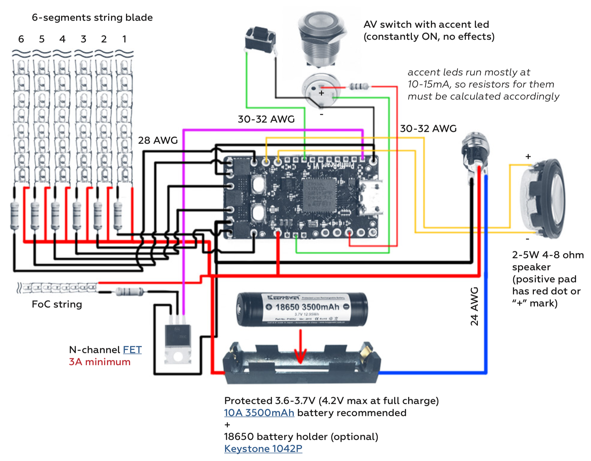

#### ProffieBoard {docsify-ignore}
# Wiring Diagrams {docsify-ignore}

## What's needed
- ProffieBoard
- micro SD-card (see page 42 for recommendations)
- a USB micro SD-card reader (to load sound files from PC to micro SD card)
- micro USB data transfer cable (CABLES THAT SUPPORT ONLY CHARGING WON’T WORK!)
- wires of different gauges (32-20 AWG) (PTFE coated copper stranded wires recommended), heat shrink 
- ESD safe soldering station, solder wire, flux etc..
- pliers, helping hands etc..
- isopropyl alcohol to clean pads before soldering (helps solder to stick better)
- Digital Multimeter (VERY USEFUL!)
- computer running Windows, Linux or Mac OS with internet access
- 3.7V Li-Ion Protected rechargeable battery, switches, recharge port, speaker, LEDs, resistors, chassis etc.. 
- mart Li-Ion CC-CV (Constant Current - Constant Voltage mode) battery charger for 3.7V (4.2V) cells
- patience...

## Board pinout


**Battery +** – 2.6 to 4.5 volt input, drives everything except the LEDs  
**Battery -** – negative pad for LEDs, needs to be at same level as GND when both are connected. Both pads are internally connected  
**GND** – ground for electronics except LEDs. Note that there are two GND pads on the board that are internally connected  
**Speaker +/-** – hooks up to speaker  
**Activation (1) / Aux (2) / Aux2 button (3)** – hook up to closing buttons, or potentially touch buttons  
**Blade ID / Neopixel Data 1** – normally used to measure the blade ID restor, and if it’s a neopixel blade, feed out neopixel data  
**Data 2, 3, 4, 5** – additional neopixel data outputs, or free for other purposes  
**LED 1, 2, 3, 4, 5, 6** – hooks up to negative side of LED (positive side of LED hooks up directly to battery.) These pads can handle up to 30 volts  
**SDA, SCL** – these pins are used to wire OLED display or to communicate with the gyro and accelerometer chip  
**RX, TX** – these pins are used for wiring a bluetooth module for wireless control  
**SWDCLK, SWDIO** – can be hooked up to a ST-LINK device and lets you debug programs running on the ProffieBoard  
**+5V** – generated by the ProffieBoard, normally it’s only ON when sound is playing  
**+3.3V** – generated by the ProffieBoard for powering OLED display, Bluetooth module or some accent leds  
**BOOT, RESET** – buttons to put the ProffieBoard in bootloader mode if uploading doesn’t work  
**micro USB port** – micro USB port used only for firmware upload and can be used for sound files upload to SD card (soon to be implemented). THIS PORT ISN’T USED FOR CHARGING THE BATTERY!  

## Basic Tri-Cree wiring diagram


In case no additional high power leds are needed, LED channels 4, 5, 6 can be used for 3 controllable (programmable for different effects) accent leds. So AV switch led can be wired to one of these channels. Accent leds also can be wired to Data pads 1-5, please see “Accent LEDs wiring and setup” page.

[LED Resistor Calculator](https://www.thecustomsabershop.com/LedCalc.aspx)

### Basic Tri-Cree config.h file setup
Use a given or build your wiring diagram on [THIS PAGE](https://fredrik.hubbe.net/lightsaber/v4/), then open any _config.h file in the “lightsaber > config” folder directory in any Text Editor (Notepad - to see code correctly in Notepad, Cut-and-Paste it to WordPad, then Cut-and-Paste it back to Notepad, Save), Ctrl+A (select all text) and Delete it, then Copy-and-Paste (Ctrl+C, Ctrl+V) your wiring diagram config code (example below) into empty _config.h file and Save it under new name. Follow the instructions on page 22 to upload it to the board. 

```c
#ifdef CONFIG_TOP
#include "proffieboard_v1_config.h" /* ProffieBoard config setup */
#define NUM_BLADES 1                /* Number of blades used */
#define NUM_BUTTONS 2               /* Number of buttons used (1-3) */
#define VOLUME 1000                 /* Volume level (0 - 3000) */
const unsigned int maxLedsPerStrip = 144;
#define CLASH_THRESHOLD_G 1.0       /* Clash sensitivity (adjust lower or higher with 0.1 step) */
#define ENABLE_AUDIO
#define ENABLE_MOTION
#define ENABLE_WS2811
#define ENABLE_SD
#endif

#ifdef CONFIG_PRESETS
Preset presets[] = {
   { "TeensySF", "tracks/venus.wav",
    StyleNormalPtr<CYAN, WHITE, 300, 800>(),            /* Blade 1 style */
    StyleNormalPtr<CYAN, WHITE, 300, 800>(), "cyan"},   /* Blade 2 style (not needed if only using 1 blade */
   { "SmthJedi", "tracks/mars.wav",
    StylePtr<InOutSparkTip<EASYBLADE(BLUE, WHITE), 300, 800> >(), "blue"},
   { "SmthGrey", "tracks/mercury.wav",
    StyleFirePtr<RED, YELLOW>(), "fire"},
   { "SmthFuzz", "tracks/uranus.wav",
    StyleNormalPtr<RED, WHITE, 300, 800>(), "red"},
   { "RgueCmdr", "tracks/venus.wav",
    StyleFirePtr<BLUE, CYAN>(), "blue fire"},
   { "TthCrstl", "tracks/mars.wav",
    StylePtr<InOutHelper<EASYBLADE(OnSpark<GREEN>, WHITE), 300, 800> >(), "green"},
   { "TeensySF", "tracks/mercury.wav",
    StyleNormalPtr<WHITE, RED, 300, 800, RED>(), "white"},
   { "SmthJedi", "tracks/uranus.wav",
    StyleNormalPtr<AudioFlicker<YELLOW, WHITE>, BLUE, 300, 800>(), "yellow"},
   { "SmthGrey", "tracks/venus.wav",
    StylePtr<InOutSparkTip<EASYBLADE(MAGENTA, WHITE), 300, 800> >(), "magenta"},
   { "SmthFuzz", "tracks/mars.wav",
    StyleNormalPtr<Gradient<RED, BLUE>, Gradient<CYAN, YELLOW>, 300, 800>(), "gradient"},
   { "RgueCmdr", "tracks/mercury.wav",
    StyleRainbowPtr<300, 800>(), "rainbow"},
   { "TthCrstl", "tracks/uranus.wav",
    StyleStrobePtr<WHITE, Rainbow, 15, 300, 800>(), "strobe"},
   { "TeensySF", "tracks/venus.wav",
    &style_pov, "POV"},
   { "SmthJedi", "tracks/mars.wav",
    &style_charging, "Battery\nLevel"}
};

/* LED Configuration */
BladeConfig blades[] = {
 { 0, SimpleBladePtr<CreeXPE2RedTemplate<1000>, CreeXPE2GreenTemplate<0>, CreeXPE2BlueTemplate<240>, NoLED>(), 
    SimpleBladePtr<CreeXPE2RedTemplate<1000>, CreeXPE2GreenTemplate<0>, CreeXPE2BlueTemplate<240>, NoLED, bladePowerPin4, bladePowerPin5, bladePowerPin6, -1>(), CONFIGARRAY(presets) },
};
/* LED configuration (use these XP-E2 LED templates to define your LED. If other LED resistors are used, change these values to match: Ohm*1000=<value>) */
/* <CreeXPE2RedTemplate<1000> */
/* here 1000 is 1 Ohm resistor, 0 is no resistor, 240 is 0.24 Ohm resistor, NoLED – no 4th led used */


#endif

#ifdef CONFIG_BUTTONS
Button PowerButton(BUTTON_POWER, powerButtonPin, "pow");
Button AuxButton(BUTTON_AUX, auxPin, "aux");
#endif
```

## Basic Neopixel wiring diagram


In case no additional Neopixel strips are needed, LED channels 4, 5, 6 can be used for 3 controllable (programmable for different effects) accent leds. So AV switch led can be wired to one of these channels. Accent leds also can be wired to Data pads 2-5, please see “Accent LEDs wiring and setup” page.

Recommended power wire gauges (22 AWG) are given for 2-strip blade. For 3-strip blade you gonna need at least 20 AWG wires.

### Basic Neopixel “config.h” file setup
Use a given or build your wiring diagram on [THIS PAGE](https://fredrik.hubbe.net/lightsaber/v4/), then open any _config.h file in the “lightsaber > sconfig” folder directory in any Text Editor (Notepad - to see code correctly in Notepad, Cut-and-Paste it to WordPad, then Cut-and-Paste it back to Notepad, Save), Ctrl+A (select all text) and Delete it, then Copy-and-Paste (Ctrl+C, Ctrl+V) your wiring diagram config code (example below) into empty _config.h file and Save it under new name. Follow the instructions on page 22 to upload it to the board.

## Basic Segmented string wiring diagram


Calculate resistors for each led segment of the blade string depending on which leds are used. 5mm leds have max drive current around 25mA per led, when 10mm leds can be 100mA and 200mA per led.
So pay attention to your led max current and Forward Voltage (Vf) when calculating a segment resistor resistence as well as its wattage. Also choose wire gauges accordingly to meet segments and total blade max current draw level.

[LED Resistor Calculator](https://www.thecustomsabershop.com/LedCalc.aspx)

## Accent LEDs wiring diagram
Accent LEDs work with ProffieBoard as additional “blades” when powered by LED outputs 4, 5, 6 or Data pads 1, 2, 3, 5 as PWM. So they can have any effect that blade can have. If no effects needed, accent led can be powered just by a 3.3V output pad (power-on led indication).


## Neopixel Accent LEDs wiring diagram (Sub-blades)
With Neopixel setup additional neopixel leds or arrays can be used as accent leds. There are 2 ways to wire them: using additional Data pins 2, 3, 4, 5 or “Sub-blades” wiring with just 1 Data output pin. Same way Neopixel connectors with on-board leds can be wired.

### Option 1 - with extra Data pins


### Option 2 - with "Sub-Blades"
With this setup a single array of neopixel leds is separated into a couple of sub-blades with their own style configuration and behaviour. This is really usefull, when you want to use only one data pin. More about “Sub-blades” on ProffieOS wiki page


## OLED display wiring diagram
SSD1306 128x32 pixels OLED display allows to show battery level, current preset name, play different animations and even simple games. It can be wired to any blade configuration and requires just one additional line in the code to work. You can get monochrome display in white or blue color.


## Bluetooth module wiring and setup
Coming Soon

## Blade ID resistor functions
Coming Soon

## More wiring diagrams
[website ProffieBoard FULL wiring diagrams link](https://fredrik.hubbe.net/lightsaber/v4/)

Scroll the page down till you see the interactive diagram. Above the diagram there are components selection options. Build your saber setup with it and follow diagram to wire your board. Then you need to copy the configuration code below and paste it into your ..._config.h file.


## How to use it
**Blade ignition/retraction** – assuming you have at least one button, pressing it briefly should turn the saber on or off. If you have an AUX button, pressing it briefly should also turn the saber on and off. If you have no buttons, you can turn the saber on and off by twisting your wrist back and forth. Note that the motion has to be done long enough to count, so a very quick flick of the wrist will not work  
**Turn On muted** – double-click power button  
**Next preset** – while saber is off, click the AUX button  
**Previous preset** – hold AUX button and click the Activation button  
**Trigger Clash** – while saber is on, hit the blade  
**Trigger Lockup** – while saber is on, hold Activation button, then trigger a clash. Lockup releases when you let go of the Activation button  
**Trigger Drag** – like lockup, but point saber mostly down before holding Activation button  
**Trigger Force** – long-click AUX button  
**Start soundtrack** – long-click the Activation button  
**Trigger Blaster Block** – while saber is on, short-click AUX button  

### Serial Monitor Commands
**battery_voltage** – gets current battery voltage value  
**get_volume** – get current volume value  
**pow** – power On/Off the saber  
**set_volume <0-3000>** – set volume value (example: set_volume 500) play – play the default preset track  
**play tracks/<track name>** – play a specific track from tracks folder (example: play tracks/venus.wav) stop – stop the playing track  
**force** – play “force” sound effects  
**drag** – play “drag” sound effects  
**blast** – play “blaster” sound effects  
**lock** – play “lockup” sound effects  
**clash** – play “clash” sound effects  
**reset** – reboot the board  
**next pre** – switch to next preset  
**prev pre** – switch to previous preset  
**list_presets** – show all presets  
**sdtest** – test SD card speed