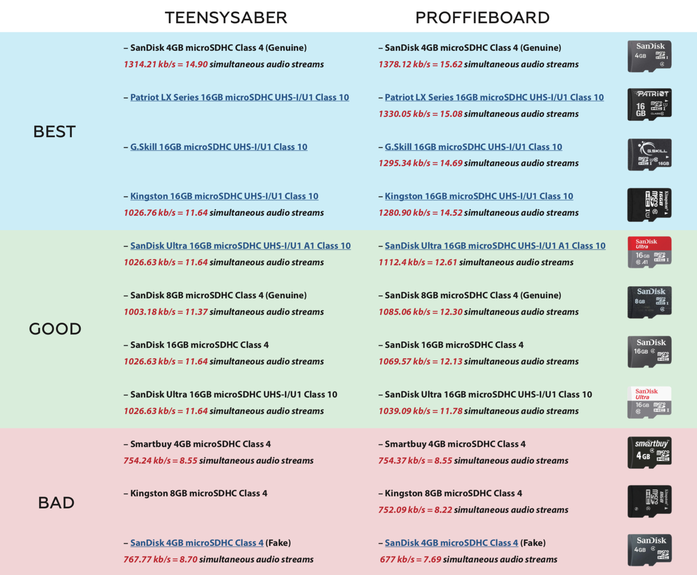

# Recommended SD Cards {docsify-ignore}

Here is a list of tested micro SD cards speed with ProffieBoard. Any card with speed over 900 kb/s is recommended, the higher the speed is – the better. Memory size of 4-16Gb is more than enough. Cards were tested with a default “ProffieOS_SD_Card” sound fonts content.
To test your SD card speed simply hook up ProffieBoard to PC, open Arduino IDE, go to Tools and open Serial Monitor, make sure you have New Line and 9600 baud rate selected on the bottom of Serial Monitor window, type and send sdtest command, wait for the test result.

