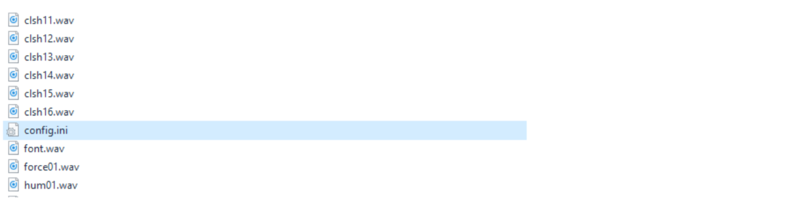

#### TeensySaber {docsify-ignore}

# Changing Sound Board Parameters {docsify-ignore}

All sound files (sound fonts, music tracks) are stored on the micro SD card. 
Add required sound fonts folders (Plecter, NEC and Smoothswing fonts are supported,
no need to change WAV files names, just copy and paste) to SD card root directory 
as it’s done in the default ProffieOS_SD_Card content folder and music tracks to the tracks folder.

Make sure to name all music tracks and sound fonts folders with latin characters 
and only up to 8 characters long, without using any special characters (like ?,.|\}{[/- etc.).  
Make sure you have a config.ini file in each sound font folder, if there is none - 
copy one from some default TeensySaber/ProffieBoard sound font and paste 
into newly added sound font folder. It has only one parameter that you can modify - humstart.
It helps to match hum sound start with blade ignition, 1000 usually works fine.

All blade effects, LED configuration, volume level, clash sensitivity etc. are changed 
in the config.h file located in **lightsaber>config** folder. 
To do that open any _config.h file in the “lightsaber>config” folder directory 
in any Text Editor (Notepad - to see code correctly in Notepad, Cut-and-Paste 
it to WordPad, then Cut-and-Paste it back to Notepad, Save), **Ctrl+A** (select all text) 
and **Delete** it, then **Copy-and-Paste** (**Ctrl+C, Ctrl+V**) your 
[wiring diagram config code](https://fredrik.hubbe.net/lightsaber/v3/) 
into empty _config.h file and **Save** it under new name. 
Follow the instructions on page 22 to upload it to the board.