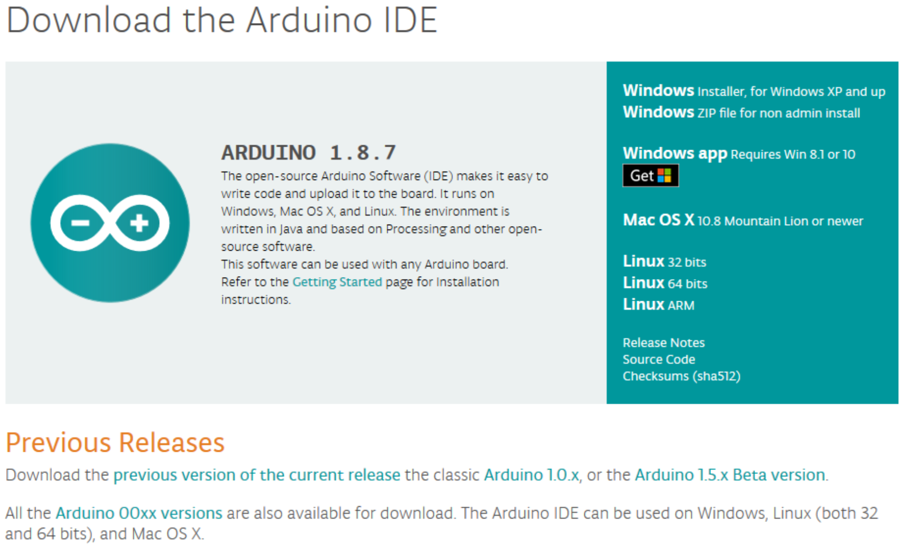
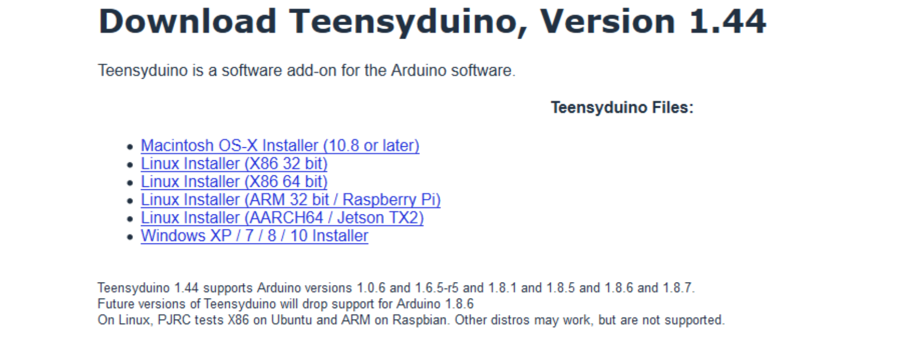
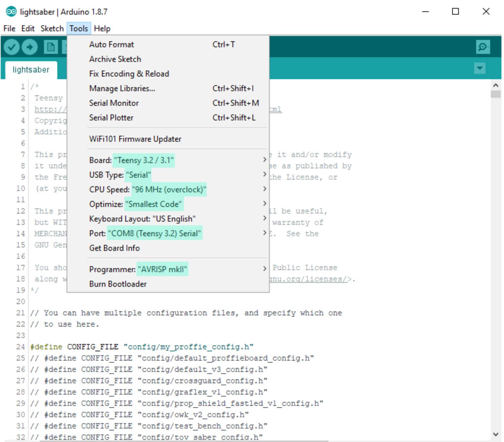

#### TeensySaber {docsify-ignore}

# Firmware upload and update {docsify-ignore}

## Software installation and setup
1. Install latest [Arduino IDE](https://www.arduino.cc/en/Main/Software) software (don’t use BETA).   
Installing as Windows app also is not recommended, because it will be installed 
in a specific protected folder that won’t allow you to install Teensyduino software in it.  
If TeensySaber won’t show up in COM port, use Arduino IDE 1.8.6 version.

2. Install latest [Teensyduino](https://www.pjrc.com/teensy/td_download.html) software in same directory, usually it’s: C:\Program Files (x86)\Arduino on Windows.  
Follow installation instructions for your system.

3. Select Teensy 3.2 / 3.1 in Tools -> Board  
USB Type – Serial  
CPU Speed – 96 MHz (overclock)  
Optimize – Smallest Code (or Fast/Faster/Fastest)  
Port – COM(the number your PC assigned) (Teensy 3.2) Serial  
Connect TeensySaber via USB cable to PC to be able to select the Port, don’t forget to connect battery first.

## Uploading Firmware
