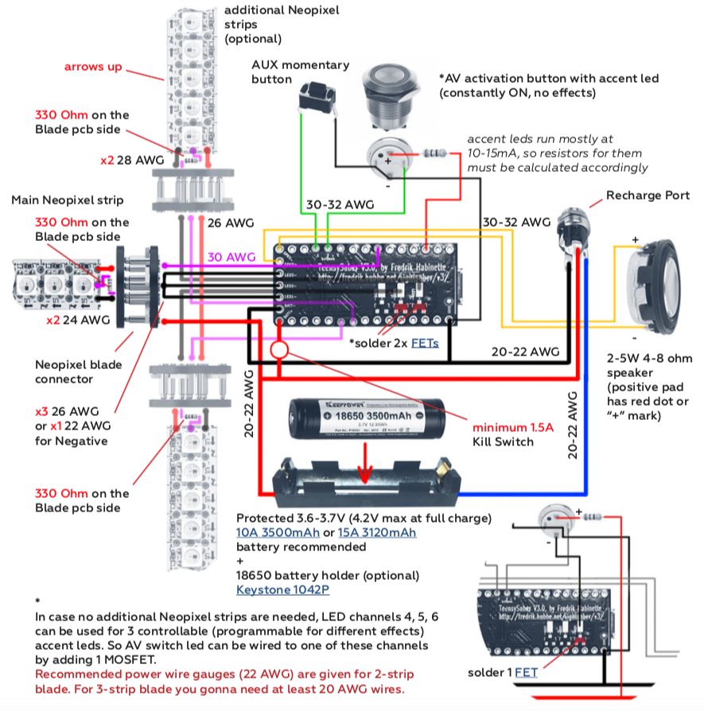

#### TeensySaber {docsify-ignore}
# Wiring Diagrams {docsify-ignore}

## Board Pinout


**Battery +** – 2.6 to 4.5 volt input, drives everything except the LEDs  
**Battery -** – negative pad for LEDs, needs to be at same level as GND when both are connected  
**GND** – ground for electronics except LEDs. Note that GND is also available on short edge of the teensy (See the teensy pinout for details)  
**Speaker +/-** – hooks up to speaker
**Activation / Aux / Aux2 button** – hook up to closing buttons, or potentially touch buttons  
**Blade ID / Neopixel Data 1** – normally used to measure the blade ID restor, and if it’s a neopixel blade, feed out neopixel data  
**LED 1, 2, 3** – hooks up to negative side of LED (positive side of LED hooks up directly to battery.) These pads can handle
up to 30 volts  
**LED 4, 5, 6** – like LED1/2/3, but requires FETs to be placed on the bottom of the board to function. Voltage is limited by
selection of FETs  
**Power 1, Power 2, Power 3** – these control the FETs which drive LED 1, 2, 3  
**AUX LED 1, 2, 3** – these are hooked up to pads on the bottom which can be populated with FETs and used to drive additional LEDs. If the bottom FETs are not populated, these pins are free and can be used for any purpose  
**RX3, TX3** – these pins are used for wiring a bluetooth module for wireless control or additional Neopixel Data out  
**SDA, SCL** – these pins are used to wire OLED display  
**+3.3V 250mA max** – generated by the Teensy for powering OLED display or Bluetooth module  
**micro USB port** – micro USB port used only for firmware upload and can be used for sound files upload to SD card.  
THIS PORT ISN’T USED FOR CHARGING THE BATTERY!

## Board Assembling
1. **IMPORTANT!**
Cut the tiny trace with a knife between VIN and VUSB as shown.  
Teensy 3.2, bottom view.

2. Solder 2.54mm header pins (gold plated recommended) to TeensySaber V3 board on the top 
or on the bottom depending on where you want to put Teensy 3.2 board.  
(please see next step).

3. Solder Teensy 3.2 board on top:  
(A – micro USB port on top, SD card between boards) or on the bottom (B – SD card on top, micro USB port between boards).


## Basic Tri-Cree wiring diagram (In-hilt LED)


[LED Resistor Calculator](https://www.thecustomsabershop.com/LedCalc.aspx)
### config.h file setup 
Use a given or build your wiring diagram on [THIS PAGE](https://fredrik.hubbe.net/lightsaber/v3/), then open any _config.h file in the “lightsaber>config” folder directory in any Text Editor (Notepad - to see code correctly in Notepad, Cut-and-Paste it to WordPad, then Cut-and-Paste it back to Notepad, Save), Ctrl+A (select all text) and Delete it, then Copy-and-Paste (Ctrl+C, Ctrl+V) your wiring diagram config code (example below) into empty _config.h file and Save it under new name. Follow [these instructions](/teensy/firmware-upload-update) to upload it to the board.

## Basic Neopixel wiring diagram


### config.h file setup 
Use a given or build your wiring diagram on [THIS PAGE](https://fredrik.hubbe.net/lightsaber/v3/), then open any _config.h file in the “lightsaber>config” folder directory in any Text Editor (Notepad - to see code correctly in Notepad, Cut-and-Paste it to WordPad, then Cut-and-Paste it back to Notepad, Save), Ctrl+A (select all text) and Delete it, then Copy-and-Paste (Ctrl+C, Ctrl+V) your wiring diagram config code (example below) into empty _config.h file and Save it under new name. Follow [these instructions](/teensy/firmware-upload-update) to upload it to the board.

## Basic Segmented string wiring diagram


Calculate resistors for each led segment of the blade string depending on which leds are used. 5mm leds have max drive current around 25mA per led, when 10mm leds can be 100mA and 200mA per led.  
So pay attention to your led max current and Forward Voltage (Vf) when calculating a segment resistor resistence as well as its wattage. Also choose wire gauges accordingly to meet segments and total blade max current draw level.

[LED Resistor Calculator](https://www.thecustomsabershop.com/LedCalc.aspx)

### config.h file setup 

Use a given or build your wiring diagram on [THIS PAGE](https://fredrik.hubbe.net/lightsaber/v3/), then open any _config.h file in the “lightsaber>config” folder directory in any Text Editor (Notepad - to see code correctly in Notepad, Cut-and-Paste it to WordPad, then Cut-and-Paste it back to Notepad, Save), Ctrl+A (select all text) and Delete it, then Copy-and-Paste (Ctrl+C, Ctrl+V) your wiring diagram config code (example below) into empty _config.h file and Save it under new name. Follow the instructions on page 22 to upload it to the board.

## Accent LEDs wiring diagram (optional)
Accent LEDs work with TeensySaber board as additional “blades” when powered by LED outputs 4, 5, 6 with FETs. So they can have any effect that blade can have. If no effects needed, accent led can be powered just by a 3.3V output pad (power-on led indication).


## OLED display wiring diagram (optional)
SSD1306 128x32 pixels OLED display allows to show battery level, current preset name, play different animations and even simple games. It can be wired to any blade configuration and requires just one additional line in the code to work. You can get monochrome display in white or blue color.


[SSD1306](https://www.ebay.com/itm/Mini-0-91-Zoll-OLED-SSD1306-Display-I2C-IIC-Arduino-Raspberry-128x32-weiss/253295920124) - with blue or white display color select.  
[SSD1306](https://www.ebay.com/itm/0-91-128x32-I2C-IIC-Serial-Blue-OLED-LCD-LED-Display-Module-12832-SSD1306/182371257748) - cheaper price  
[SSD1306 just screen](https://www.ebay.com/itm/128x32-White-Blue-0-91in-OLED-bare-screen-Module-OLED-SSD1306-LCD-AU/323299955387) - blue or white select


## Bluetooth module wiring diagram (optional)
Bluetooth modules **FSC-BT630** and **FSC-BT909** from Feasycom have been chosen over other modules on the market because of the best pcb size, quality, functionality and price point.  
**FSC-BT630** has same functionality as **FSC-BT909** but twice smaller size, lower signal strength and only BLE protocol support (no SPP).  
Both modules are recommended for use with **ForceSync** mobile app (currently in development) from ShtokCustomWorx.


For maximum bluetooth signal efficiency for both modules follow these rules:  
1. Place BT module as far from Negative (GND) wires and battery as possible
2. Place BT module as far from the speaker as possible
3. Place BT module under some holes in the hilt or plastic parts around antenna


### Bluetooth module setup

FSC-BT630 and FSC-BT909 bluetooth modules are programmed by AT commands using any serial terminal software. 
But from some vendors they come already pre-programmed, so can be wired and installed straight out of the box. 
Then you just need to connect to one of these two modules and set bluetooth name and pin code via FeasyBlue app  
(download on Google Play or App Store) on Android or iOS smartphone/tablet device. 
Also both modules support OTA firmware upgrade via bluetooth from Android device using FeasyBlue app.


Add #define ENABLE_SERIAL line to your TeensySaber config.h file:
```c
#define ENABLE_WS2811
#define ENABLE_SD
#define ENABLE_SERIAL

#endif

#ifdef CONFIG PRESETS
```

If you buy directly from **Feasycom** manufacturer on alibaba, make sure to ask seller to pre-program FSC-BT909 modules with these AT commands, or you need to program them yourself via any Serial Terminal software on PC (like **YAT** or **Serial Monitor** in Arduino IDE):

```c
AT+PROFILE=5  
AT+COD=00050C  
AT+TPMODE=1  
AT+AUTOCONN=0  
AT+PAIR=1  
AT+SSP=0  
AT+BAUD=115200  
AT+BTEN=1  
```

For how to connect any bluetooth module to PC using a USB-to-TTL cable please read this thread - [LINK](http://therebelarmory.com/thread/8699/wireless-bluetooth-plecter-sound-boards). Follow the specific module pinout for connecting wires.

**FSC-BT630** modules currently have no settings to program, they work straight out of the box.
Then you just need to set **passcode** and **name** for both modules via **FeasyBlue app** using your smartphone.

Both modules support **OTA firmware upgrade** (Over The Air) via bluetooth SPP connection (with Android smartphones only at the moment), so if new features are added to the bluetooth module firmware in the future by Feasycom, modules can be easily updated inside the saber without rewiring.

## Blade ID resistor functions
COMING SOON

## More wiring diagrams

## How to use it
**Blade ignition/retraction** – assuming you have at least one button, pressing it briefly should turn the saber on or off. If you have an AUX button, pressing it briefly should also turn the saber on and off. If you have no buttons, you can turn the saber on and off by twisting your wrist back and forth. Note that the motion has to be done long enough to count, so a very quick flick of the wrist will not work.  
**Turn On muted** – double-click power button  
**Next preset** – while saber is off, click the AUX button  
**Previous preset** – hold AUX button and click the Activation button  
**Trigger Clash** – while saber is on, hit the blade  
**Trigger Lockup** – while saber is on, hold Activation button, then trigger a clash. Lockup releases when you let go of the Activation button  
**Trigger Drag** – like lockup, but point saber mostly down before holding Activation button  
**Trigger Force** – long-click AUX button  
**Start soundtrack** – long-click the Activation button  
**Trigger Blaster Block** – while saber is on, short-click AUX button  

## Serial Monitor Commands
**battery_voltage** – get current battery voltage value   
**get_volume** – get current volume value  
**pow** – power On/Off the saber  
**on** – power On the saber  
**off** – power Off the saber  
**set_volume** <0-3000> – set volume value (example: set_volume 500)  
**play** – play the default preset track, stop playing track while it’s playing  
**play tracks/<track name>** – play a specific track from tracks folder (example: play tracks/venus.wav)  
**force** – play “force” sound effects  
**drag** – play “drag” sound effects  
**blast** – play “blaster” sound effects  
**lock** – play “lockup” sound effects  
**clash** – play “clash” sound effects  
**reset** – reboot the board  
**n** – switch to next preset  
**p** – switch to previous preset  
**list_presets** – show all presets  
**sdtest** – test SD card speed  